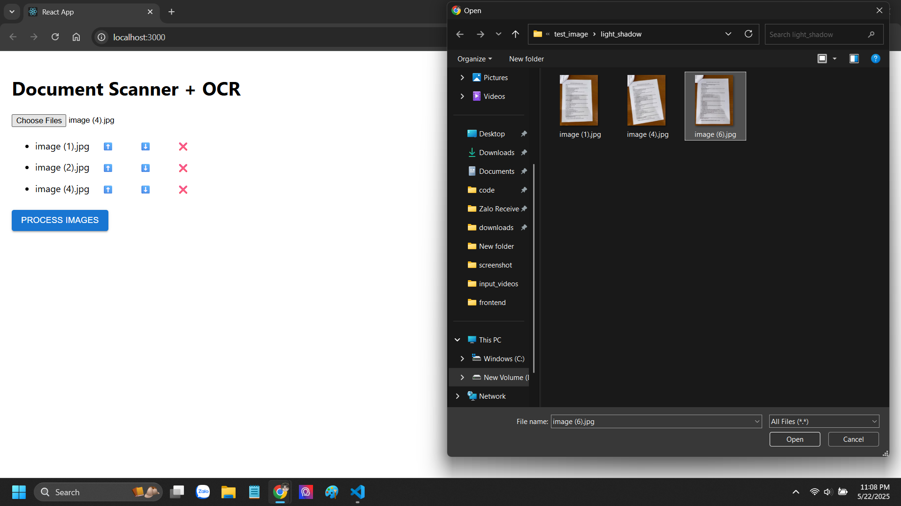
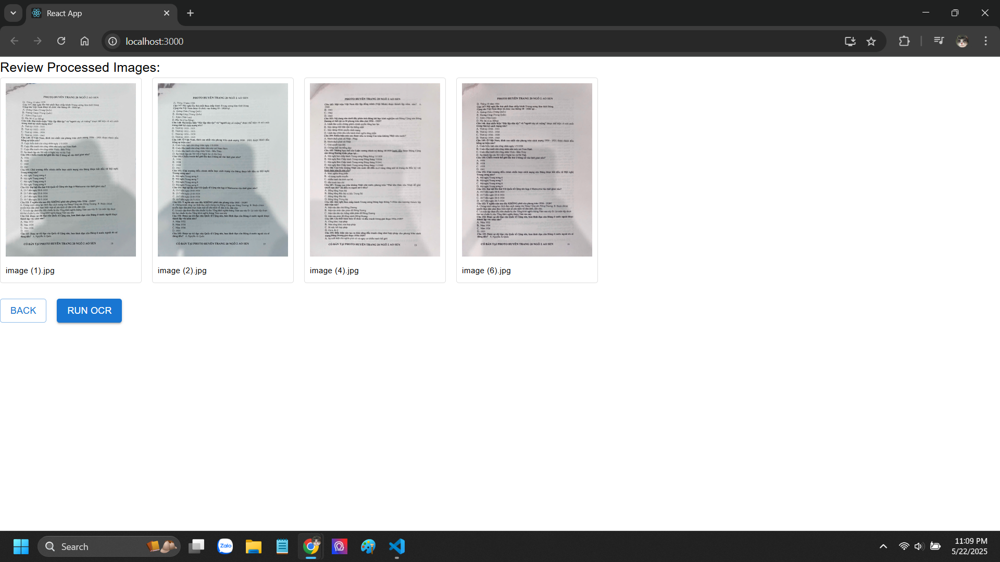
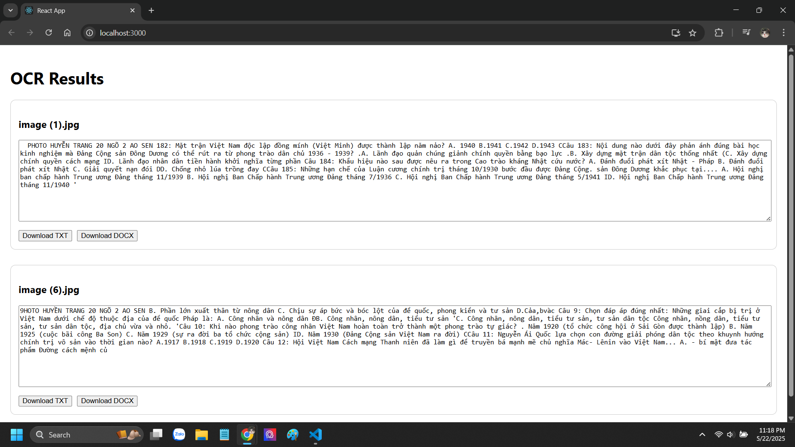

# Doc-Scanner
# Image Preprocessing and OCR Web App

This is a full-stack web application that allows users to:

1. **Upload scanned or photographed documents**
2. **Automatically detect image borders using a pretrained deep learning model**
3. **Preprocess (rectify) the images**
4. **Perform OCR (Optical Character Recognition) on the rectified images**
5. **Download the extracted text in `docx` or `.txt` format**

---

## Features

- Upload multiple images at once
- Automatic border detection using a pretrained model from GitHub
- Image rectification based on the detected borders
- OCR text extraction from processed images
- Download results in your preferred format (`docx` or `.txt`)
- Clean, user-friendly React frontend
- Flask backend with RESTful APIs

---

## Technologies Used

| Layer                  | Tech Stack                        |
|------------------------|-----------------------------------|
| Frontend               | React, Axios                      |
| Backend                | Flask, Flask-CORS                 |
| OCR                    | Tesseract OCR                     |
| Page Recognition Model |DocScanner                         |
| File Handling          | Python `os`, `uuid`, `base64`     |

---

## How It Works

### 1. Preprocessing

- **Endpoint**: `POST /api/preprocess`
- **Input**: Multiple user-uploaded images
- **Steps**:
  - Detect borders using a pretrained segmentation model (`seg.pth`)
  - Rectify the image (crop & deskew)
  - Return base64-encoded versions of the processed images and a session ID

### 2. OCR

- **Endpoint**: `POST /api/ocr`
- **Input**: Session ID
- **Steps**:
  - Perform OCR on rectified images
  - Store extracted text in both `.txt` and `.docx` formats

### 3. Download

- **Endpoint**: `GET /api/download?sessionId=<ID>&format=txt|json`
- **Output**: Downloadable text file from OCR results

---

## UI Screenshots

### Step 1: Upload & Preview
Users select multiple images to upload.


### Step 2: Rectified Image Display
Images are processed using a pretrained model and shown for confirmation.


### Step 3: OCR Output & Download
Extracted text is displayed and available for download.


---

## Citation
I used the DocScanner model from the GitHub repository [https://github.com/fh2019ustc/DocScanner].

---

##  Getting Started

```bash
cd backend
pip install -r requirements.txt
python app.py

cd frontend
npm install
npm start


